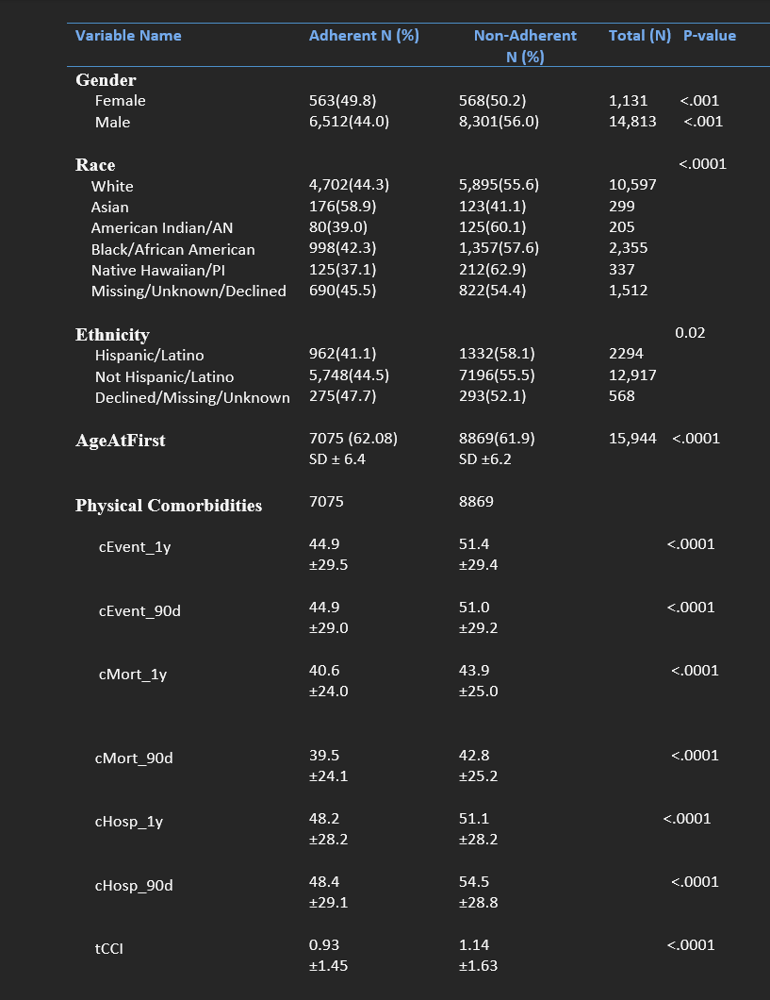
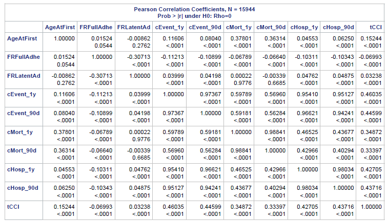

# CRCanalysis
      This is an analysis of Co-rectal Cancer patients from the age group of 50 years and above. The dataset consistis of population from VA hospital. 
## Hypothesis:
           We are looking at whether what Sociodemographic variables influence patients to be more adherentto the FITkit that are being given to them to detect CA. 
## Analysis:
       Started with looking at correlation of the variables.
       Multicollinarity
       Variance
       Univariate model
       Descriptives
       Logistic Regresssion
  
  
  
      